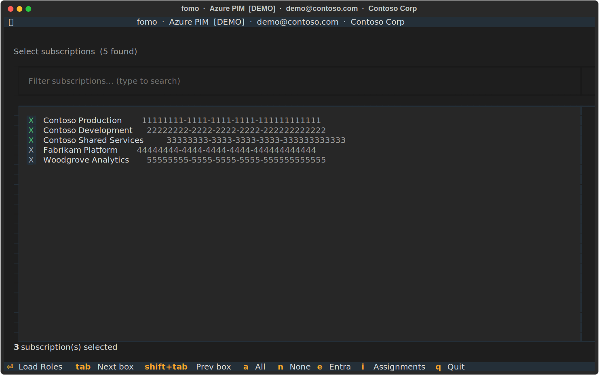
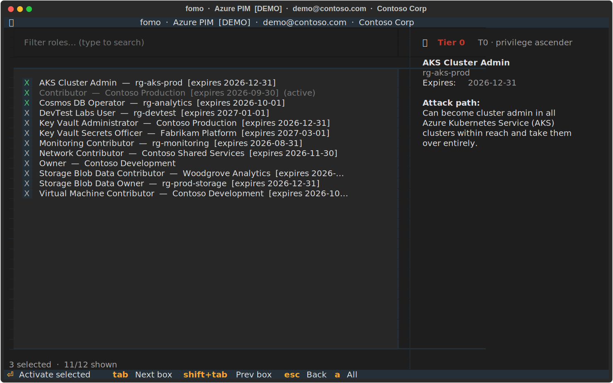
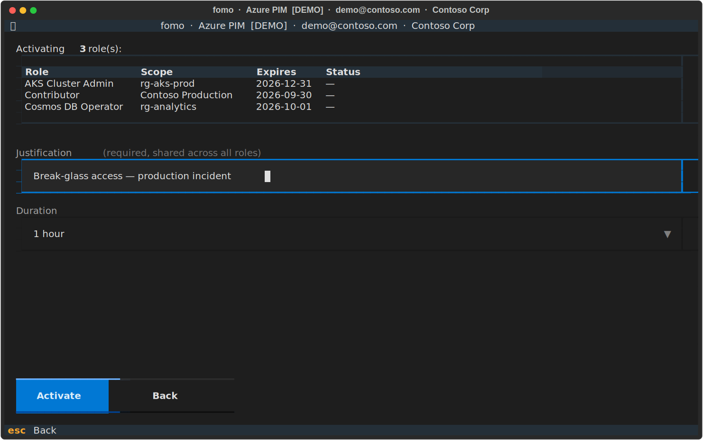

# fomo

A terminal UI for activating Azure PIM eligible roles with multiselect.

## Features

- **Multiselect activation** — pick multiple eligible roles across subscriptions in one go
- **Azure RBAC & Entra roles** — supports both subscription/resource-scoped PIM roles and Entra directory roles (Global Administrator, etc.)
- **Management group scope** — activate roles at management group level
- **Parallel activation** — all selected roles are activated concurrently with per-role progress tracking
- **Non-interactive CLI mode** — skip the TUI with `-r`/`--reason` for scripting and automation
- **Dry-run mode** — simulate activation without making any real API calls
- **Cached Entra token** — device code sign-in only required once; refresh token stored at `~/.cache/fomo/graph_token.json`
- **Verbose logging** — write full API call/response logs to a file for troubleshooting

## Screenshots

### Subscription selection



### Role selection



### Activation



## Platform support

Works on Linux, macOS, and WSL (Windows Subsystem for Linux).

## Prerequisites

- [Azure CLI](https://learn.microsoft.com/en-us/cli/azure/install-azure-cli) (`az`) — logged in with `az login`
- Python ≥ 3.11
- [`uv`](https://docs.astral.sh/uv/) or [`pipx`](https://pipx.pypa.io/)

## Install

**Using uv (recommended):**

```sh
uv tool install git+https://github.com/jvik/fomo
```

**Using pipx:**

```sh
pipx install git+https://github.com/jvik/fomo
```

**From a specific release wheel** (find the versioned `.whl` on the [releases page](https://github.com/jvik/fomo/releases/latest)):

```sh
uv tool install https://github.com/jvik/fomo/releases/latest/download/fomo-VERSION-py3-none-any.whl
```

## Update

**Using uv:**

```sh
uv tool upgrade fomo
```

**Using pipx:**

```sh
pipx upgrade fomo
```

## Usage

```sh
fomo
```

### Azure roles

1. Select a subscription scope
2. Multiselect the eligible roles to activate
3. Enter a justification and confirm — activation runs in parallel

### Entra roles

1. Select *Entra roles* from the main menu
2. The app fetches your eligible directory roles via Microsoft Graph (first use requires a **device code** browser sign-in)
3. Multiselect the roles to activate (already-active roles are marked)
4. Choose a duration, enter a justification, and confirm

**Dry-run mode** (no real API calls):

```sh
fomo --dry-run
```

**Verbose logging** (write debug logs to a file):

```sh
fomo --log /tmp/fomo.log
```

Logs include all `az rest` and Graph API calls and responses. Useful for troubleshooting.

### Non-interactive (CLI) mode

Skip the TUI entirely by providing `-r`/`--reason` on the command line. Role and subscription names accept substrings; the first exact match wins, otherwise the first substring match.

**Azure RBAC (subscription scope)** — provide `SUBSCRIPTION` and `ROLE` as positional arguments:

```sh
fomo my-sub "Key Vault Administrator" -r "Break-glass access" -t 1h
```

**Management group scope** — use `--mg` with the management group name:

```sh
fomo --mg my-mg "Reader" -r "Audit review" -t 30m
```

**Entra ID roles** — use `--entra` with the role name:

```sh
fomo --entra "Global Reader" -r "Audit review" -t 1h
```

The `-t`/`--time` flag accepts ISO 8601 durations (`PT1H`, `PT30M`) or shorthand (`1h`, `30m`). Defaults to `PT1H`.

All three forms respect `--dry-run` to simulate activation without API calls.
